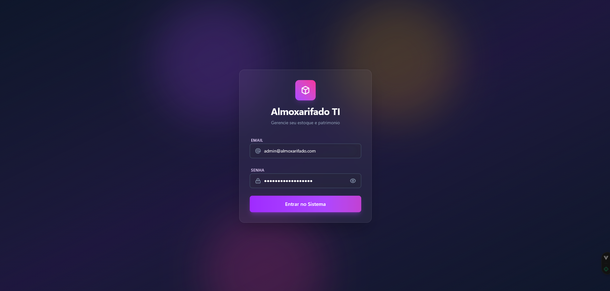
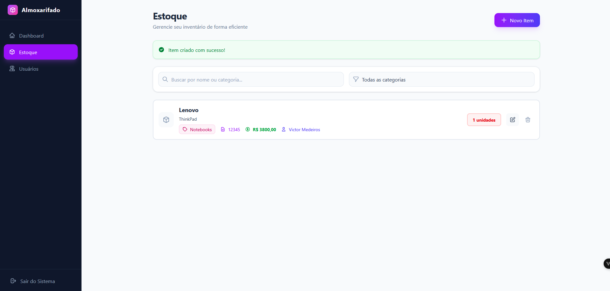
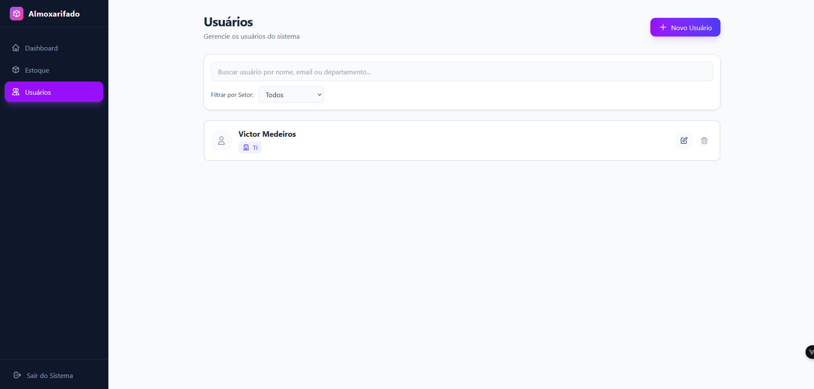

# 📦 Sistema Corvi

> Sistema completo de gerenciamento de estoque e patrimônio para o setor de TI, desenvolvido com **Go**, **Vue.js** e **PostgreSQL**.

---

## 🎯 Sobre o Projeto

Plataforma web full-stack para controle eficiente de inventário de equipamentos e materiais de TI, com recursos avançados de gestão patrimonial, vinculação de itens a usuários e dashboard analítico em tempo real.

---

## ✨ Principais Funcionalidades

### 🔐 Autenticação & Segurança
- Login seguro com **JWT** e proteção CSRF
- Proteção contra **Timing Attacks** e brute force
- Rate limiting e validações robustas
- Hash bcrypt para senhas

### 📦 Gestão de Estoque
- CRUD completo de itens com validações
- **10 categorias** predefinidas com código de cores
- Controle de patrimônio (5 dígitos únicos)
- Vinculação de itens a usuários
- Formatação automática de valores monetários
- Validação de quantidade em estoque

### 👥 Gestão de Usuários
- CRUD completo de usuários do setor
- **12 departamentos** predefinidos
- Exclusão em cascata (remove itens vinculados)
- Busca e filtros em tempo real
- Autocomplete inteligente

### 📊 Dashboard Analítico
- Cards com métricas principais
- Gráficos de distribuição por categoria
- Alertas de estoque baixo
- Cálculo automático de valor total
- Interface estilo Power BI

---

## 📸 Demonstração

### Tela de Login
Interface moderna com glassmorphism e animações suaves.



---

### Dashboard Analítico
Visão geral com métricas principais, alertas e gráficos de distribuição por categoria.


---

### Gerenciamento de Estoque
CRUD completo de itens com autocomplete, validações e busca em tempo real.



---

### Gerenciamento de Usuários
Controle de usuários por departamento com exclusão cascata de itens vinculados.



---

## 🛠️ Stack Tecnológica

### Backend
- **Go 1.25.5** - Alta performance e concorrência
- **PostgreSQL 16** - Banco de dados relacional
- **JWT** - Autenticação stateless
- **bcrypt** - Hash seguro de senhas
- **CORS** - Controle de origens

### Frontend
- **Vue.js 3.5** - Framework progressivo (Composition API)
- **Vite** - Build tool ultrarrápido
- **Pinia** - State management
- **Tailwind CSS v4** - Framework CSS utility-first
- **Axios** - Cliente HTTP

### DevOps
- **Docker** - Containerização
- **Docker Compose** - Orquestração multi-container
- **Migrations** - Versionamento de schema

---

## 🔒 Segurança Implementada

✅ **JWT Secret forte** - Validação de 32+ caracteres obrigatória  
✅ **CSRF Protection** - Double Submit Cookie  
✅ **Timing Attack Prevention** - Tempo constante no login  
✅ **Rate Limiting** - Proteção contra brute force  
✅ **Password Hashing** - Bcrypt com cost 10  
✅ **SQL Injection Prevention** - Prepared statements  
✅ **Input Validation** - Backend + Frontend  
✅ **CORS Configurado** - Origens específicas

---

## 🎨 Características do Design

- 🎭 Glassmorphism e blur effects
- 🌈 Gradientes animados
- 🎯 Iconografia consistente
- 📱 Design responsivo
- ⚡ Animações suaves
- 🎨 Paleta roxa/índigo moderna
- 🔔 Feedback visual em tempo real

---

## 📊 Recursos do Dashboard

- 📈 Total de itens no estoque
- ⚠️ Alertas de estoque baixo (< 5 unidades)
- 💰 Valor total estimado do patrimônio
- 📊 Gráficos de distribuição por categoria
- 🎯 Percentuais calculados automaticamente
- 🔄 Atualização em tempo real

---

## 🔌 API REST

Arquitetura RESTful com endpoints para:
- Autenticação (login, token refresh)
- Itens (CRUD completo)
- Usuários (CRUD com cascata)
- Health checks (API e Database)

Todas as rotas protegidas requerem:
- Header `Authorization: Bearer <token>`
- Header `X-CSRF-Token` em operações de escrita

---

## 📁 Arquitetura

### Backend (Go)
```
backend/
├── cmd/api/              # Entrypoint da aplicação
├── config/               # Configurações e env vars
├── internal/
│   ├── handlers/         # HTTP handlers (controllers)
│   ├── middleware/       # Auth, CSRF, Rate Limit
│   ├── models/           # Structs de dados
│   ├── repositories/     # Data access layer
│   ├── services/         # Business logic
│   └── database/         # Migrations e seeds
```

### Frontend (Vue.js)
```
frontend/src/
├── views/                # Páginas da aplicação
├── components/           # Componentes reutilizáveis
├── stores/               # Pinia stores (state)
├── router/               # Vue Router (rotas)
├── services/             # API client (Axios)
└── assets/               # CSS e recursos estáticos
```

---

## 🎯 Features Técnicas

- ✅ **Clean Architecture** - Separação de camadas
- ✅ **Repository Pattern** - Abstração de dados
- ✅ **Service Layer** - Lógica de negócio
- ✅ **Middleware Chain** - Processamento de requisições
- ✅ **Database Migrations** - Versionamento de schema
- ✅ **Auto Seeding** - Admin padrão criado automaticamente
- ✅ **Health Checks** - Monitoramento de serviços
- ✅ **CORS** - Controle de acesso cross-origin
- ✅ **Environment Variables** - Configuração via .env

---

## 📦 Tecnologias e Bibliotecas

### Backend Go
- `golang-jwt/jwt` - Geração e validação de tokens
- `golang.org/x/crypto/bcrypt` - Hash de senhas
- `lib/pq` - Driver PostgreSQL
- `rs/cors` - Middleware CORS
- `go-playground/validator` - Validação de structs

### Frontend Vue
- `vue-router` - Roteamento SPA
- `pinia` - State management
- `axios` - Cliente HTTP
- `tailwindcss` - Framework CSS

---

## 🔥 Diferenciais

- 🎯 **Interface Intuitiva** - UX focada em produtividade
- ⚡ **Performance** - Go para backend de alta performance
- 🔒 **Segurança em Primeiro Lugar** - Múltiplas camadas de proteção
- 📊 **Analytics Integrado** - Dashboard com métricas importantes
- 🔄 **Real-time** - Busca e filtros instantâneos
- 🎨 **Design Moderno** - UI atual e profissional
- 🐳 **100% Dockerizado** - Deploy simplificado
- 📱 **Responsivo** - Funciona em qualquer dispositivo

---

**Desenvolvido para otimizar a gestão de patrimônio e estoque de TI** ⚡
